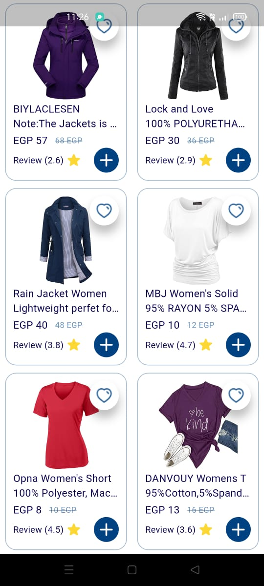
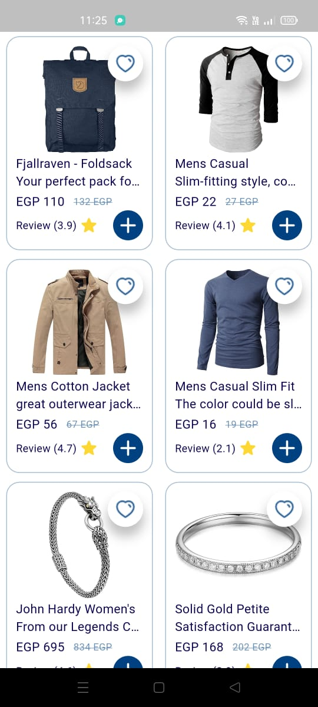

# 🛍️ Products App - Flutter Task

A Flutter application that displays a list of products from [FakeStore API](https://fakestoreapi.com), featuring offline caching and real-time internet connectivity checks.

## ✨ Features
- **Product Grid**: Responsive 2-column grid layout with elegant cards
- **BLoC/Cubit State Management**: Clean state handling (Loading/Success/Error)
- **Offline Support**: Hive local caching when offline
- **Connection-Aware**: Auto-switches between API/local data

## 📸 Screenshots
|  |  |

## 🛠 Tech Stack
- **Flutter**: 3.19.5
- **State Management**: BLoC/Cubit
- **Local Cache**: Hive
- **Networking**: http + InternetConnectionChecker

## 🏗 Project Structure
lib/
├── core/
│ ├── constants/ AppColors.dart
│ ├── theme/ AppThemeData.dart
│ └── utils/ CashProducts.dart
├── data/
│ ├── local/ ProductsLocalImpl.dart
│ ├── remote/ ProductsRemoteImpl.dart
│ ├── models/ Product.dart
│ └── repositories/ ProductsRepo.dart
└── features/
├── bloc/ ProductsCubit.dart, cubit_states.dart
└── products/
└── presentation/
├── screens/ ProductsScreen.dart
└── widgets/ ProductItem.dart      └── widgets/ ProductItem